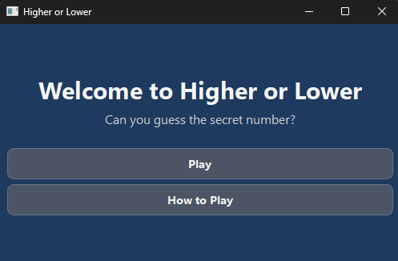
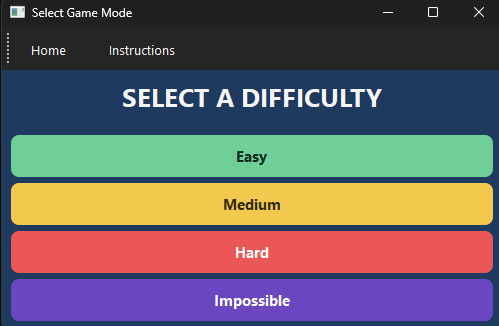
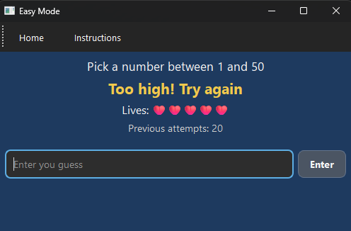
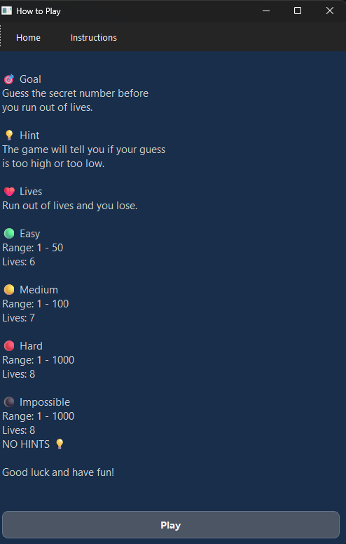

# Welcome to Higher or Lower 

Higher or Lower is a desktop number guessing game of luck and skill. It is built with Python and PySide6.

## Features
- Easy, Medium, and Hard game modes
- Custom GUI
- Lives system
- Previous attempts
- Input validation
- Custom toolbar
- Styled interface

## Technologies
- Python
- PySide6
- Object-Oriented Programming

## How to Download
- [Cick here to Download for MAC](https://github.com/xluis28/Higher-or-Lower-Python/releases/download/v1.0.1/Higher-or-Lower.app.zip)

### If macOS blocks the application

Because this application is not digitally signed with an Apple Developer certificate, macOS may prevent it from opening the first time.

If this happens:

1. Open **System Settings**.
2. Navigate to **Privacy & Security**.
3. Scroll to the **Security** section.
4. Click **Open Anyway** next to **HigherOrLower.app**.
5. Confirm by clicking **Open** when prompted.
After completing these steps, the application should open normally in the future.

- [Click here to Download for WINDOWS](https://github.com/xluis28/Higher-or-Lower-Python/releases/download/v1.0.0/Higher-or-Lower.exe)
### Note:** Windows may display a SmartScreen warning because the application is not digitally signed. If this happens, click **More info** and then **Run anyway**.
## Welcome Screen

The main menu where the player can start the game or read the instructions.

---

## Difficulty Selection

Choose between Easy, Medium, Hard, and Impossible.

---

## Gameplay

Guess the secret number before you run out of lives.

---

## Instructions

Learn the rules and difficulty settings.
